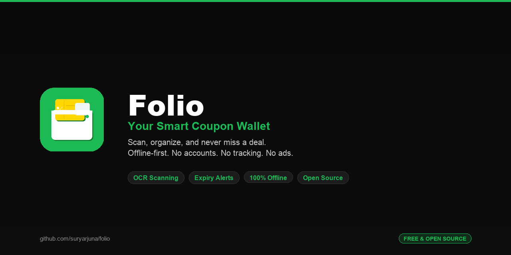

# Folio — Coupon Wallet

<p align="center">
  
</p>

A smart, offline-first coupon wallet app built with React Native and Expo. Scan, organize, and never let a coupon expire again.

## Features

- **OCR Coupon Scanning** — Point your camera at any coupon or import from your photo library. ML Kit OCR automatically extracts company name, promo code, discount, expiry date, minimum purchase, and more.
- **Smart Organization** — Search, sort (by company, expiry, date added, discount), and filter by category. Pin favorites to the top.
- **Expiry Tracking** — Color-coded expiry chips (green/yellow/red) show urgency at a glance. An "Expiring Soon" banner highlights coupons expiring within 3 days.
- **Auto-Archive** — Expired coupons are automatically moved to the archive when you open the app. Mark coupons as "used" to archive them manually.
- **Duplicate Detection** — Prevents adding the same coupon twice by matching company name + promo code or expiry date.
- **Local Notifications** — Optional reminders before coupons expire (configurable days in advance).
- **Dark Mode** — Follows your system theme with a carefully designed dark palette.
- **Fully Offline** — All data stored locally in SQLite. No accounts, no cloud, no tracking.

## Screenshots

> _Coming soon_

## Tech Stack

| Layer | Technology |
|---|---|
| Framework | [React Native](https://reactnative.dev/) 0.83 + [React](https://react.dev/) 19 |
| Platform | [Expo](https://expo.dev/) SDK 55 with [Expo Router](https://docs.expo.dev/router/introduction/) |
| Language | [TypeScript](https://www.typescriptlang.org/) 5.9 (strict mode) |
| Database | [SQLite](https://docs.expo.dev/versions/latest/sdk/sqlite/) via `expo-sqlite` |
| OCR | [ML Kit](https://github.com/nickhudkins/react-native-mlkit-ocr) via `react-native-mlkit-ocr` |
| Notifications | `expo-notifications` (local only) |
| Storage | `@react-native-async-storage/async-storage` for user preferences |
| Image Processing | `expo-image-manipulator` for thumbnail generation |

## Project Structure

```
folio/
├── app/                        # Expo Router screens & navigation
│   ├── _layout.tsx             # Root stack (DB init, auto-archive)
│   ├── index.tsx               # Entry redirect (onboarding or wallet)
│   ├── onboarding.tsx          # First-launch onboarding flow
│   ├── add-coupon.tsx          # Source picker (camera/library/manual)
│   ├── processing.tsx          # OCR processing with animation
│   ├── edit-coupon.tsx         # Coupon form (create/edit)
│   ├── coupon-detail.tsx       # Full coupon view
│   └── (tabs)/                 # Bottom tab navigator
│       ├── _layout.tsx         # Tab config
│       ├── wallet.tsx          # Active coupons list
│       ├── archive.tsx         # Used & expired coupons
│       └── settings.tsx        # App settings
├── src/
│   ├── components/             # Reusable UI components
│   │   ├── CouponCard.tsx      # Card with company stripe & perforation
│   │   ├── CompanyInitials.tsx  # Colored initials badge
│   │   ├── ExpiryChip.tsx      # Color-coded expiry indicator
│   │   └── EmptyState.tsx      # Empty list placeholder
│   ├── constants/
│   │   ├── types.ts            # TypeScript interfaces & enums
│   │   └── theme.ts            # Colors, spacing, radius, categories
│   ├── db/
│   │   └── database.ts         # SQLite schema & CRUD operations
│   ├── hooks/
│   │   ├── useCoupons.ts       # Data fetching hooks
│   │   └── useColorScheme.ts   # Theme-aware color hook
│   ├── services/
│   │   ├── ocrService.ts       # OCR text extraction & parsing
│   │   ├── imageService.ts     # Image save & thumbnail generation
│   │   ├── duplicateDetection.ts # Duplicate coupon checks
│   │   ├── notificationService.ts # Expiry reminder scheduling
│   │   └── exportService.ts    # CSV/PDF export
│   └── utils/
│       └── helpers.ts          # UUID, date utils, color hashing
├── assets/                     # App icons & splash screen
├── scripts/
│   └── generate_icons.py       # Icon generator (Pillow)
├── docs/
│   ├── index.html              # Privacy policy page (GitHub Pages)
│   └── privacy-policy.md       # Privacy policy (markdown reference)
├── app.json                    # Expo configuration
├── tsconfig.json               # TypeScript config
├── package.json                # Dependencies & scripts
└── index.ts                    # Root entry point
```

## Getting Started

### Prerequisites

- [Node.js](https://nodejs.org/) 18+
- [Expo CLI](https://docs.expo.dev/get-started/installation/) (`npm install -g expo-cli`)
- iOS Simulator (macOS) or Android Emulator, or [Expo Go](https://expo.dev/go) on a physical device

### Installation

```bash
# Clone the repository
git clone https://github.com/suryarjuna/folio.git
cd folio

# Install dependencies
npm install

# Start the development server
npm start
```

### Running on Devices

```bash
# iOS Simulator
npm run ios

# Android Emulator
npm run android

# Web (limited — camera/OCR not available)
npm run web
```

> **Note:** OCR and camera features require a physical device or emulator with camera support. They are not available in Expo Go web.

## How It Works

### Coupon Scanning Flow

1. Tap the **+** button on the Wallet screen
2. Choose a source: **Camera**, **Photo Library**, or **Manual Entry**
3. For camera/photo: the image is processed by on-device ML Kit OCR
4. Extracted data (company, code, discount, expiry, etc.) pre-fills the edit form
5. Review, adjust, and save — the coupon appears in your wallet

### Data Model

Each coupon stores:

| Field | Type | Description |
|---|---|---|
| `companyName` | string | Brand/store name |
| `code` | string? | Promo/coupon code |
| `discountDescription` | string | Human-readable discount (e.g., "20% off") |
| `discountValue` | number? | Numeric discount value |
| `discountType` | enum | `percentage`, `fixedAmount`, `bogo`, `freeShipping`, `other` |
| `expiryDate` | ISO string? | Expiration date |
| `categories` | JSON string | Array of category tags |
| `couponImageUri` | string? | Full-resolution image path |
| `thumbnailUri` | string? | 200px compressed thumbnail |
| `status` | enum | `active`, `used`, `expired` |
| `isFavorite` | 0 \| 1 | Pinned to top of wallet |

### OCR Extraction

The OCR service parses scanned text to extract:

- **Company name** — topmost non-data text block
- **Promo code** — labeled codes (`CODE: SAVE20`) or standalone alphanumeric strings
- **Discount** — percentage off, dollar off, BOGO, free shipping
- **Expiry date** — multiple formats (`Jan 15, 2026`, `01/15/2026`, `01-15-26`)
- **Minimum purchase** — dollar thresholds
- **Website URL** — `.com`, `.net`, `.org` domains
- **Terms & conditions** — text following "terms", "t&c", or asterisks

Each extraction includes a **confidence score** (0.0–1.0) based on how many fields were successfully detected.

## Design

### App Icon

The icon is generated programmatically via `scripts/generate_icons.py` (requires Python 3 + [Pillow](https://pillow.readthedocs.io/)). It produces all required assets in one run:

| Asset | Size | Purpose |
|---|---|---|
| `icon.png` | 1024x1024 | iOS app icon / store listing |
| `splash-icon.png` | 1024x1024 | Splash screen |
| `favicon.png` | 48x48 | Web favicon |
| `android-icon-foreground.png` | 512x512 | Android adaptive icon foreground |
| `android-icon-background.png` | 512x512 | Android adaptive icon background (solid green) |
| `android-icon-monochrome.png` | 432x432 | Android monochrome icon |

To regenerate after making changes to the script:

```bash
python3 scripts/generate_icons.py
```

### Theme

- **Primary:** `#1DB954` (vibrant green — savings energy)
- **Accent:** `#FFD700` (gold — coupon ticket, expiring soon highlight)
- **Danger:** `#EF4444` (red — urgent/delete actions)
- Light and dark mode with system-follow

### Card Design

Coupon cards mimic physical vouchers — echoing the wallet-and-ticket motif from the app icon:
- A colored left **stripe** with company initials (deterministic color per company)
- A **perforation effect** separator (dotted line, like the coupon in the icon)
- Discount description, promo code chip, and color-coded expiry chip

## Privacy

Folio is fully offline. No data leaves your device. No analytics, no ads, no accounts.

Read the full [Privacy Policy](https://suryarjuna.github.io/folio/privacy-policy.html).

## Contributing

Contributions are welcome! Please:

1. Fork the repository
2. Create a feature branch (`git checkout -b feature/my-feature`)
3. Commit your changes
4. Push to the branch (`git push origin feature/my-feature`)
5. Open a Pull Request

## License

This project is licensed under the MIT License. See [LICENSE](LICENSE) for details.

---

Built with React Native + Expo
